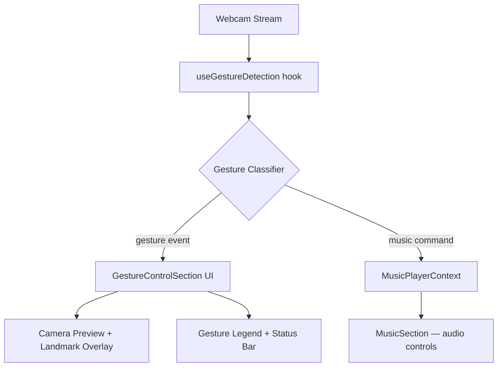

# Design Document — Gesture Music Control

## Overview

The Gesture Music Control feature adds a new portfolio section that uses the browser's MediaPipe Hands library to detect hand gestures from the webcam and map them to music playback commands (next/previous track, volume up/down, speed up/down). It is implemented entirely in the frontend — no backend changes are required. The section sits between the existing MusicSection and AboutSection in `App.js` and shares playback state with MusicSection via a lifted state / shared ref pattern.

---

## Architecture

The feature is structured around three concerns:

1. **Gesture Detection** — a custom React hook (`useGestureDetection`) that owns the MediaPipe Hands lifecycle, processes landmark data, classifies gestures, and emits gesture events.
2. **Music Control Bridge** — `MusicSection` is refactored to expose imperative controls (next, prev, setVolume, setRate) via a forwarded ref or a shared context, so the gesture layer can drive it without prop-drilling.
3. **UI Layer** — a new `GestureControlSection` component renders the camera preview, landmark canvas overlay, gesture legend, and real-time status indicators.



### State Lifting Strategy

Currently `MusicSection` owns all audio state internally. To allow gesture commands to control playback, audio state and controls will be lifted into a `MusicPlayerContext` (React Context + useReducer). Both `MusicSection` and `GestureControlSection` consume this context.

---

## Components and Interfaces

### `MusicPlayerContext` (`src/context/MusicPlayerContext.jsx`)

Provides shared playback state and dispatch to the entire app.

```js
// State shape
{
  tracks: Track[],          // from mock.js
  currentTrackIndex: number, // 0-based index into tracks array
  isPlaying: boolean,
  volume: number,            // 0.0 – 1.0
  playbackRate: number,      // 0.25 – 2.0
  audioRef: React.MutableRefObject<HTMLAudioElement>
}

// Actions
type Action =
  | { type: 'NEXT_TRACK' }
  | { type: 'PREV_TRACK' }
  | { type: 'PLAY_TRACK'; index: number }
  | { type: 'PAUSE' }
  | { type: 'SET_VOLUME'; value: number }   // clamped 0.0–1.0
  | { type: 'SET_RATE'; value: number }     // clamped 0.25–2.0
  | { type: 'SEEK'; ratio: number }
```

### `useGestureDetection` (`src/hooks/useGestureDetection.js`)

Custom hook that encapsulates the full MediaPipe Hands pipeline.

```js
const {
  videoRef,       // attach to <video> element
  canvasRef,      // attach to <canvas> overlay
  isReady,        // boolean — model loaded
  isDetecting,    // boolean — camera active
  lastGesture,    // { name: string, action: string, timestamp: number } | null
  error,          // string | null
  startDetection,
  stopDetection,
} = useGestureDetection({ onGesture: (gesture) => void });
```

Internally it:
- Dynamically imports `@mediapipe/hands` and `@mediapipe/camera_utils`
- Runs `requestAnimationFrame` loop calling `hands.send({ image: videoRef.current })`
- Passes results to the gesture classifier
- Draws landmarks on the canvas overlay

### Gesture Classifier (`src/lib/gestureClassifier.js`)

Pure function module — no React, no side effects. Takes a MediaPipe `Results` object and returns a gesture name or `null`.

```js
// classifyGesture(results) → string | null
// Possible return values:
//   'INDEX_SWIPE_RIGHT'
//   'INDEX_SWIPE_LEFT'
//   'FOUR_FINGER_SWIPE_UP'
//   'FOUR_FINGER_SWIPE_DOWN'
//   'OPEN_HAND'
//   'CLOSED_FIST'
//   null
```

Classification logic:

| Gesture | Detection Method |
|---|---|
| Index Swipe Right | Only index fingertip extended; track tip X delta > threshold over N frames |
| Index Swipe Left | Only index fingertip extended; track tip X delta < -threshold over N frames |
| Four-Finger Swipe Up | Index+middle+ring+pinky extended, thumb not required; Y delta < -threshold |
| Four-Finger Swipe Down | Index+middle+ring+pinky extended; Y delta > threshold |
| Open Hand | All 5 fingertips above their respective MCP joints (fully extended) |
| Closed Fist | All 5 fingertips below their respective MCP joints (fully curled) |

Finger extension is determined by comparing fingertip landmark Y to the PIP joint Y (tip above PIP = extended). Swipe direction is determined by tracking the centroid of relevant fingertips across a rolling 10-frame buffer.

### `GestureControlSection` (`src/components/GestureControlSection.jsx`)

Main UI component. Consumes `MusicPlayerContext` and `useGestureDetection`.

Sub-elements:
- **ActivationPanel** — shown before camera starts; "Activate Gesture Control" button
- **CameraPreview** — `<video>` + `<canvas>` overlay, mirrored via CSS `transform: scaleX(-1)`
- **GestureLegend** — static list of 6 gestures with icons; active gesture highlighted
- **StatusBar** — shows last detected gesture name + action, current volume %, current playback rate

### Updated `MusicSection`

- Removes internal audio state; reads from `MusicPlayerContext`
- Audio element lifecycle (play/pause/seek/volume/rate) is managed inside the context provider's effect

### Updated `App.js`

- Wraps content in `<MusicPlayerProvider>`
- Adds `<GestureControlSection />` between `MusicSection` and `AboutSection`

---

## Data Models

```js
// Gesture event emitted by the classifier
{
  name: string,       // e.g. 'INDEX_SWIPE_RIGHT'
  action: string,     // e.g. 'Next Track'
  timestamp: number   // Date.now()
}

// Landmark position (from MediaPipe)
{
  x: number,  // normalized 0–1
  y: number,  // normalized 0–1
  z: number   // depth estimate
}

// Frame buffer entry (for swipe detection)
{
  x: number,
  y: number,
  frameIndex: number
}
```

---

## Error Handling

| Scenario | Handling |
|---|---|
| Camera permission denied | Catch `getUserMedia` rejection; show error message + retry button |
| MediaPipe model load failure | Catch import/init error; show fallback message; disable activation button |
| No hand detected | Show "No hand detected" in status bar; no action dispatched |
| Low confidence detection (< 0.7) | Classifier returns `null`; no gesture fired |
| Gesture during cooldown | Cooldown map checked before dispatch; gesture silently ignored |
| Audio play() rejection (autoplay policy) | Catch promise rejection; update isPlaying to false in context |

---

## Testing Strategy

- **Unit tests for `gestureClassifier.js`**: Feed synthetic landmark arrays and assert correct gesture classification. This is the most testable pure logic in the feature.
- **Integration smoke test**: Render `GestureControlSection` with a mocked `useGestureDetection` hook and assert the legend and status bar render correctly.
- Manual browser testing for the full camera + gesture loop (cannot be automated in CI without a real webcam).

---

## Design Decisions

1. **MediaPipe Hands over TensorFlow.js Handpose** — MediaPipe Hands is more accurate, actively maintained, and has a smaller bundle footprint for this use case.
2. **Context over prop drilling** — Lifting audio state to context avoids threading callbacks through multiple component layers and keeps `GestureControlSection` decoupled from `MusicSection`'s internals.
3. **Pure classifier module** — Keeping gesture classification as a pure function makes it trivially unit-testable and easy to extend with new gestures.
4. **Rolling frame buffer for swipe detection** — A single-frame delta is too noisy; a 10-frame rolling window gives reliable directional intent without adding latency.
5. **Per-gesture cooldown map** — Different gestures have different cooldowns (swipes 1000ms, volume 800ms) to feel natural; a single global cooldown would make volume adjustment feel sluggish.
6. **CSS mirror on video** — Mirroring the camera feed is standard UX for selfie-style interactions; it makes gesture direction feel intuitive (user swipes right, hand moves right on screen).
